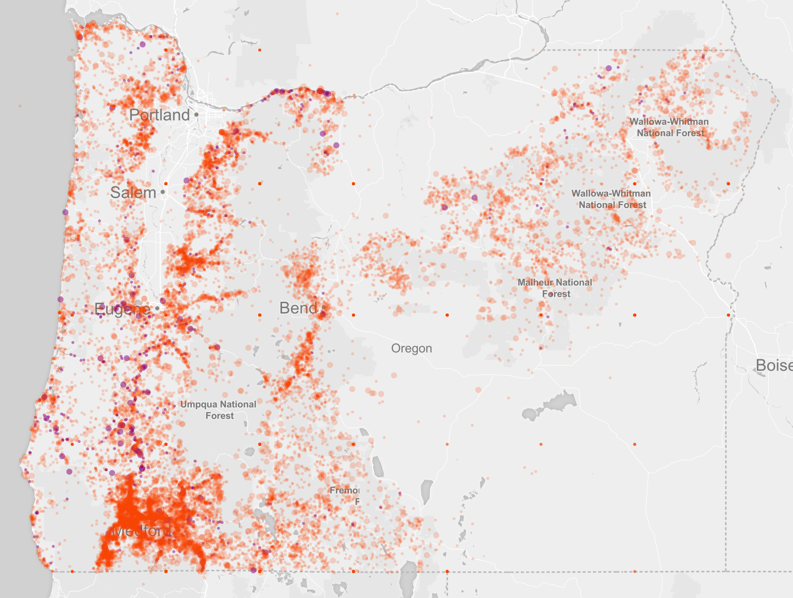
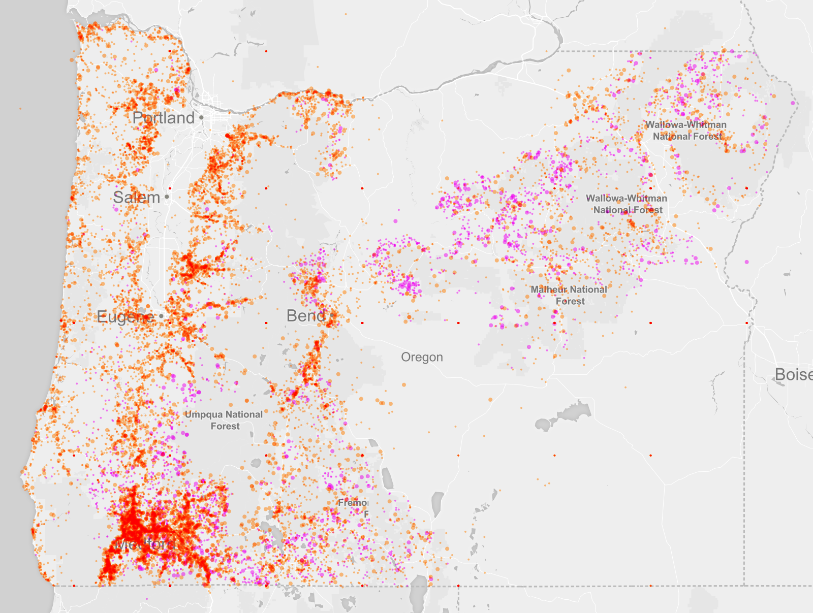
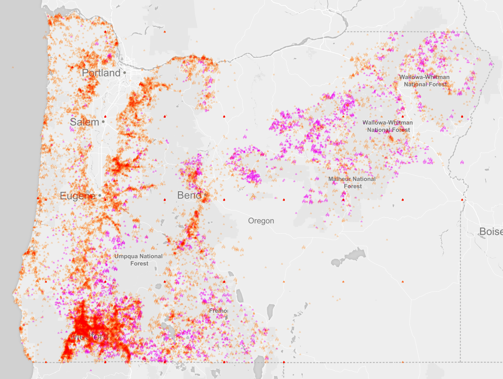

### Welcome
Hi, I'm Justin Palmer.  @Caged on twitter.  I'm an analytics engineer at GitHub.

I really got into maps about 4 or so years ago.  It wasn't really a purposeful decision, it just seemed like the next step for someone who is interested in data processing and data visualization.

Now I create maps for all sorts of reasons, but the two overriding reasons is that they can be very beautiful works of art and for someone like myself who can't draw a circle, this is empowering.

The second reason is an overwhelming curiosity about the data that lies beneath the map.  I want to ask questions of it. I want to know how something is and why something is.  If I were a cat, data would be my brown paper bag.  I have to jump in and see what's in this thing!

### What we're going to create

Today we're going to play with fire.  We're going to create a map of [all of the fires recorded by Oregon since 2004](https://data.oregon.gov/Natural-Resources/2005-2014-Fire-Data/9nkj-mp3y).

The goal of this session isn't to create the most beautifully polished map (which we wont), but to try and cover a lot of ground and go through what a real process looks like.

It's not a linear process.  I spend the majority of my time looking through datasets and interrogating data, trying to find what might be interesting. What might be impactful.  Will is have an effect on public discourse?  Will it produce some wonderful art for my wall?  Will it change my perception of something?

When making maps for art, you can get away with exaggerations and less than rigorous standards.  When making maps to inform, especially for questions involving religion, politics, and baseball, you have to be as honest as possible because people will use your maps to bolster their position.

The first step is to find a dataset and ask questions of it.

### Find your tools

You will *absolutely* need a tool that helps you cleanup, transform, and ask all sorts of question of data.  My toolbox for that includes 3 tools:

* Postgres and Postgis - A relational database with GIS extensions
* GDAL - Contains a suite of command line tools for transforming data to and from different formats and a ton of other things.
* Microsoft Excel - You will encounter datasets that are locked away in excel.  You will wish you had excel.  Apple Numbers isn't suited for large datasets.

### Making sense of the Data.

For this part, I'm going to talk through some of the scripts I have written to parse the data.  I'll be using the Ruby language and Postgres, but I'm not going to go into details on how to program or how to setup and write SQL.  If you're interested in this or want to talk more about this, come see me during the break or after the class.  I'd be happy to chat with you!

I've download a fire dataset from data.oregon.gov.  I need to first see if is has the geography in a format I can read and second, if it has anything I find interesting.  

```
open csv/raw-fire-data.csv
```

* There's some weird character encoding.  That'll screw things up.
* Lat/lon are combined in a column called "Location."  We need these in two separate fields of latitude and longitude and we also need to get rid of the surrounding parenthesis.  I have written a script for this already.
* Some data is missing

But most of all.  This dataset is in GREAT SHAPE. You won't believe the terribleness of datasets you can find on the internet.  PDFS, HTML soup, terrible, terrible stuff.

```
./script/clean-data
open data/csv/fires.csv
```

We now have a clean dataset that we can examine further.  I'm going to use postgres, but you can use Excel (which I highly recommend you get a copy of),
sqlite, mysql, etc.

I like postgres because it has the most powerful GIS extensions of any piece of software that I've used. SQL is also the greatest language for asking questions of a dataset. It was designed for this purpose and for me, it's indispensable.


### Intro to MapBox Studio
Breifly walk through the Mapbox Studio editor.  For an in-depth getting started guide, check out [the official docs](https://www.mapbox.com/guides/getting-started-studio/).

### Incendio!
Ask people to open the source project maptime-step-1.tm2.  [TODO UPLOAD TO DROPBOX]

### Playing With Fire
* Create new stylesheet "fire"
* Make the points appear as a marker

```css
#fires {
   marker-width: 3;
 }
```


Point out markers in the ocean and oddly even-spaced points inside Oregon as a good example to be mindful of the conclusions we make about data.

* Change to orangered color, remove outline.

```css
#fires {
  marker-width: 3;
  marker-fill: orangered;
  marker-line-width: 0;
 }
 ```

 

* Note how not all markers aren't drawn.  Enabled `marker-allow-overlap`.

Talk about the disparity between Medford and Portland.  There are about 77k people in Medford vs. about 620k people in Portland.  

Q. What could that tell us about the fires?
A. More people != more fires.  

Q. What do we *think* might be causing the fires in Medford?
A. ...Later

```css
#fires {
  marker-width: 3;
  marker-fill: orangered;
  marker-line-width: 0;
  marker-ignore-placement: true;
  marker-opacity: 0.2;
 }
 ```

  

* Style recent (>=2014) fires a different color.
* Only show 2014.
* Only show 2010

``` sql
-- Count the number of fires in 2014 vs 2010
select count(*) from fires where year = 2010;
select count(*) from fires where year = 2014;
```


Discuss the need for some kind of spreadsheet application or a database.  Something that helps you ask questions of the data to find out what message you're trying to convey.

```css
#fires {
  marker-width: 3;
  marker-fill: orangered;
  marker-line-width: 0;
  marker-allow-overlap: true;
  marker-opacity: 0.2;

  [year >= 2014] {
    marker-width: 6;
  }
 }
 ```


* Use description to style "motorist" a different direction.

```css
#fires {
  marker-width: 3;
  marker-fill: orangered;
  marker-line-width: 0;
  marker-allow-overlap: true;
  marker-opacity: 0.2;

  [year >= 2014] {
    marker-width: 6;
  }

  [cause='motorist'] {
   marker-fill: purple;
   marker-opacity: 0.5;
  }
 }
 ```



* Change cause to lightning.  Talk about how it aligns with Medford.

```css
#fires {
  marker-width: 2;
  marker-fill: orangered;
  marker-line-width: 0;
  marker-allow-overlap: true;
  marker-opacity: 0.5;
  marker-comp-op: hard-light;

  [year >= 2014] {
    marker-width: 4;
  }

  [cause='lightning'] {
   marker-fill: purple;
   marker-opacity: 0.5;
  }
 }
```




* Move on to using an emoji or vector symbol for fire

Add flame.svg to the inside of your mapbox studio project file.

```css
#fires {
  marker-file: url(flame.svg);
  marker-width: 4;
  marker-fill: orangered;
  marker-line-width: 0;
  marker-allow-overlap: true;
  marker-opacity: 0.5;
  marker-comp-op: hard-light;

  [year >= 2014] {
    marker-width: 6;
  }

  [cause='lightning'] {
   marker-fill: purple;
   marker-opacity: 0.5;
  }
 }
 ```

 


### What next? Things you can do at home
* If we get done too fast, move on to talk about adjusting zoom levels.

* Followup questions:  

Q. Why do you think there are no fires in South eastern Oregon? It's not an ocean, so what gives?  
A. Dataset doesn't include federal lands or "How to be mislead with data."

* Finally, we can change styles to dark background and just play around with
  different colors to get a look we're after.
* Find data. Have fun. Be responsible.


### Notes
* Metadata isn't basically nonexistent.  Probably around here somewhere http://www.oregon.gov/ODF/Pages/index.aspx
* NFCA - No Fire Crew Action
* About 12% of fires have no description and location.  
