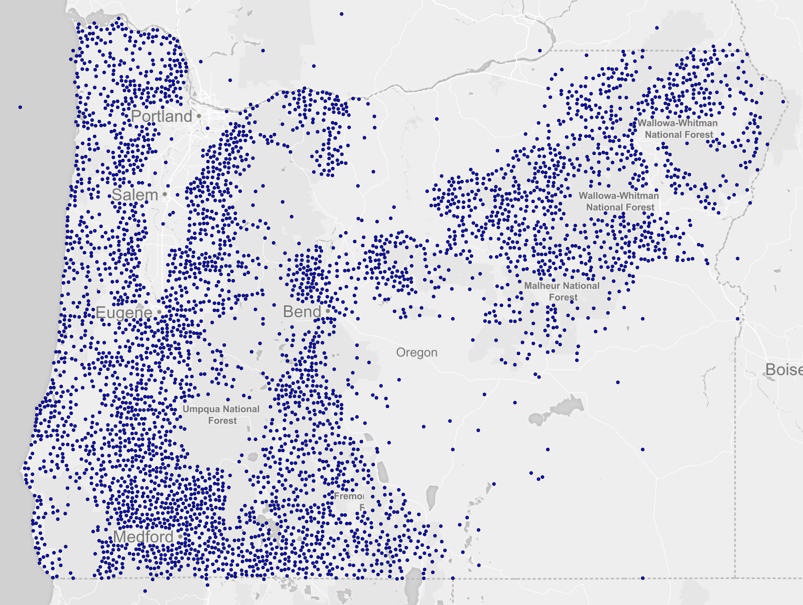
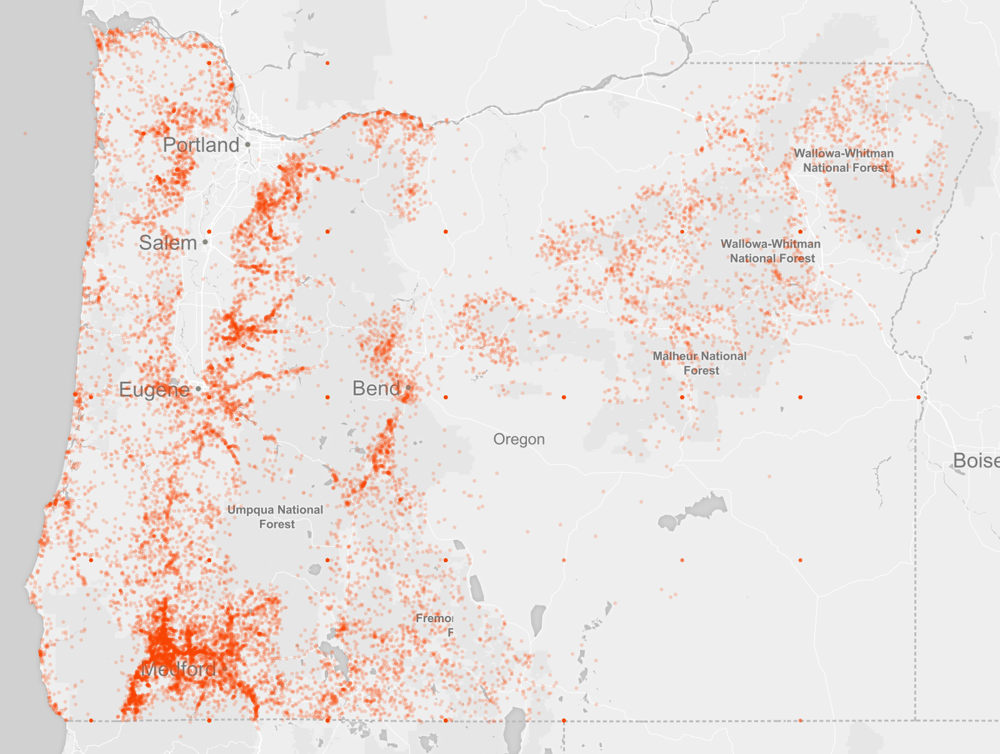
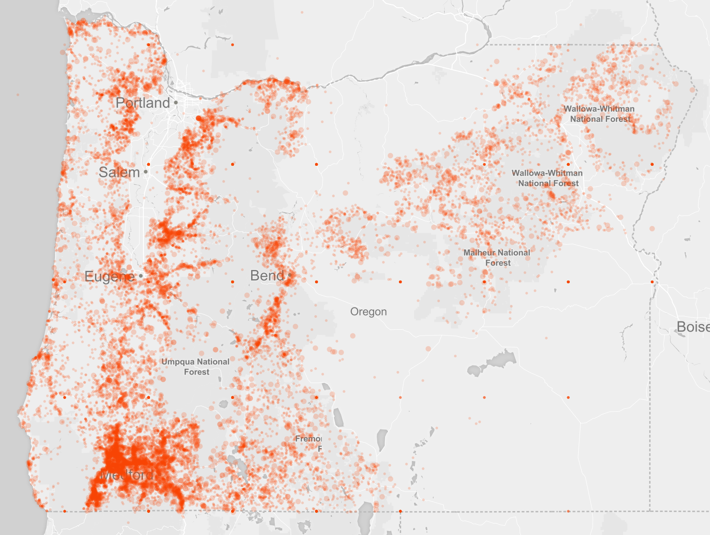

### Welcome
A brief intro.  Who I am.  What I do.  Why I make maps.

### What we're going to create
Describe what we're creating and what we'll learn.

### Intro to MapBox Studio
Not comprehensive.  Talk about the editor.  The CartoCSS markup.
Start by changing a few properties.

### Incendio!
Ask people to import [fire](https://data.oregon.gov/Natural-Resources/2005-2014-Fire-Data/9nkj-mp3y) data source that lives on MapBox.

### Playing With Fire
* Create new project using Mapbox Light
* Add caged.aa3fadad to source
* Create new stylesheet "fire"
* Make the points appear as a marker

```css
#fires {
   marker-width: 3;
 }
```



Point out markers in the ocean and oddly even-spaced points inside Oregon as a good example to be mindful of the conclusions we make about data.

* Change to orangered color, remove outline.

```css
#fires {
  marker-width: 3;
  marker-fill: orangered;
  marker-line-width: 0;
 }
 ```

 

* Note how not all markers aren't drawn.  Enabled `marker-allow-overlap`.

```css
#fires {
  marker-width: 3;
  marker-fill: orangered;
  marker-line-width: 0;
  marker-allow-overlap: true;
  marker-opacity: 0.2;
 }
 ```

  

* Style different years as a different size.

Discuss the need for some kind of spreadsheet application or a database.  Something that helps you ask questions of the data to find out what message you're trying to convey.

```css
#fires {
  marker-width: 3;
  marker-fill: orangered;
  marker-line-width: 0;
  marker-allow-overlap: true;
  marker-opacity: 0.2;

  [year >= 2010] {
    marker-width: 6;
  }
 }
 ```




* Combine with radius for year to create smaller circles for older years
* [Maybe] Discuss zoom-level styling
* Move on to using an emoji or vector symbol for fire

### What next? Things you can do at home
* Followup question:  Why do you think there are no fires in South eastern Oregon?  

* Only render Oregon
* Add county data for context
* Print your map!
* Find data. Have fun. Be responsible.


### Notes
* Metadata isn't basically nonexistent.  Probably around here somewhere http://www.oregon.gov/ODF/Pages/index.aspx
* NFCA - No Fire Crew Action
* About 12% of fires have no description and location.  
